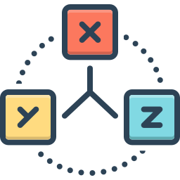

# XYZ - Redis Cache

## Patterns d'architecture micro services

- Redis (Cache-aside)
- Aggregator
- Processor
- Gateway
- 1 DB per service

## Vue d'ensemble

XYZ est une application e-commerce en architecture microservices. Elle expose une API REST via un **gateway** unique (port 3000) qui orchestre plusieurs services internes, chacun avec sa propre base de données MariaDB.

```txt
Client
  │
  ▼
gateway :3000          ← point d'entrée public
  ├── /catalog/products/*  → products-aggregator
  ├── /catalog/*           → catalog
  └── /orders/*            → order-processor
```

## Services

### gateway

Point d'entrée public. Applique les middlewares transversaux (CORS, secure headers, timeout) et route les requêtes vers les services internes. N'a aucune logique métier.

| Route publique | Service cible |
|---|---|
| `GET /catalog/products` | products-aggregator |
| `GET /catalog/products/:id` | products-aggregator |
| `/catalog/*` | catalog |
| `/orders/*` | order-processor |

### catalog

CRUD complet sur les produits (`GET /products`, `GET /products/:id`, `POST`, `PUT`, `DELETE`). Persiste en MariaDB. Utilise Redis comme cache **cache-aside** : les lectures "populaires" sont mises en cache pour éviter les requêtes répétées en base.

### stock

Gestion du stock par produit (`GET /stocks`, `GET /stocks/:productId`, `PUT`, `DELETE`). Données persistées dans une BDD MariaDB. Les lectures sont protégées par JWT. Utilise également Redis en cache-aside.

### products-aggregator — pattern Aggregator

Agrège en une seule réponse les données de **catalog** (informations produit) et de **stock** (quantité disponible). Met le résultat en cache Redis avec une TTL d'1 heure (clé `products:<id>`). Si le cache est disponible, aucun appel aux services n'est effectué.

```txt
GET /catalog/products/:id
  │
  ├── cache Redis ?  →  réponse immédiate
  │
  ├── fetch catalog /products/:id
  ├── fetch stock   /stocks/:id  (avec JWT)
  │
  └── { ...product, quantity }  →  mise en cache  →  réponse
```

### order-processor — pattern Processor

Orchestre la création d'une commande en plusieurs étapes :

1. **Validation** : pour chaque article, vérifie l'existence du produit dans catalog et contrôle que le prix correspond.
2. **Persistance** : délègue la création de la commande au service orders.

Cela isole la logique métier complexe (validation multi-service) du service orders qui reste simple.

```txt
POST /orders
  │
  ├── pour chaque item → GET catalog /products/:id (vérif existence + prix)
  │
  └── POST orders /ref  →  réponse client
```

### orders

CRUD sur les commandes (`GET /orders`, `GET /orders/:id`, `POST /ref`). Données persistées dans une BDD MariaDB. Ne contient pas de logique de validation c'est le rôle du processor.

### redis

Instance Redis partagée entre catalog, stock et products-aggregator pour le cache.

## Flux principaux

### Consulter un produit

```txt
Client → gateway → products-aggregator
                        ├── Redis (cache hit → fin)
                        ├── catalog (données produit)
                        └── stock   (quantité)
```

### Passer une commande

```txt
Client → gateway → order-processor
                        ├── catalog (validation prix × N articles)
                        └── orders  (création commande)
```

## Démarrage

```bash
# Démarrer tous les services
docker compose up

# Seeder les bases de données
docker exec catalog bun run seed
docker exec orders bun run seed
```



---


**Alexandre Leroux**
_Enseignant / Formateur_
_Développeur logiciel web & mobile_

Nancy (Grand Est, France)

<https://shrp.dev>
